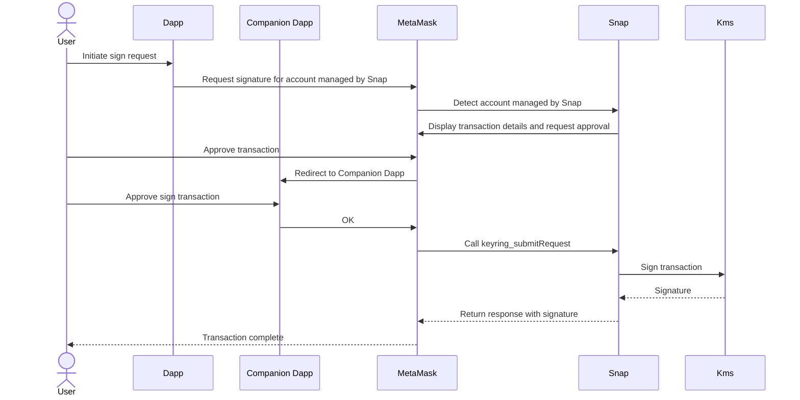

```mermaid
sequenceDiagram
    actor User
    participant Dapp
    participant CompanionDapp as Companion Dapp
    participant MetaMask
    participant Snap
    participant Kms

    User->>Dapp: Initiate sign request
    Dapp->>MetaMask: Request signature for account managed by Snap
    MetaMask->>Snap: Detect account managed by Snap
    Snap->>MetaMask: Display transaction details and request approval
    User->>MetaMask: Approve transaction
    MetaMask->>CompanionDapp: Redirect to Companion Dapp
    User->>CompanionDapp: Approve sign transaction
    CompanionDapp->>MetaMask: OK
    MetaMask->>Snap: Call keyring_submitRequest
    Snap->>Kms: Sign transaction
    Kms-->>Snap: Signature
    Snap-->>MetaMask: Return response with signature
    MetaMask-->>User: Transaction complete

```